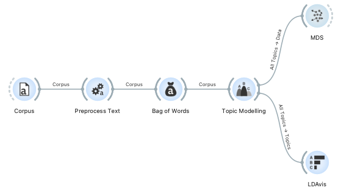
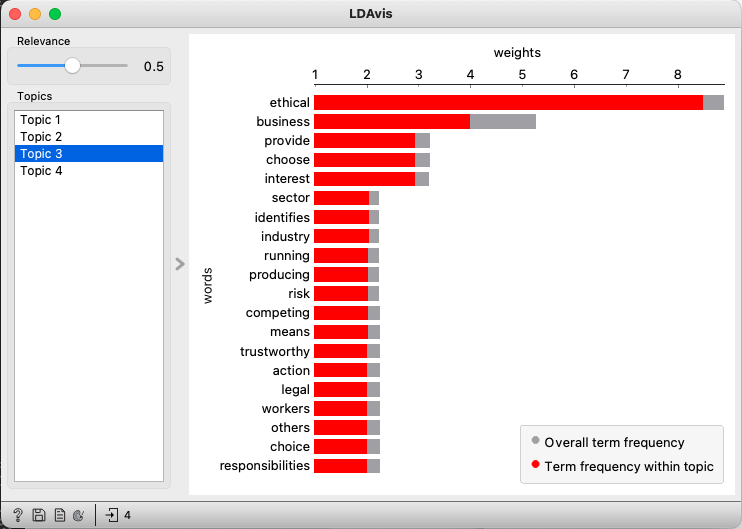
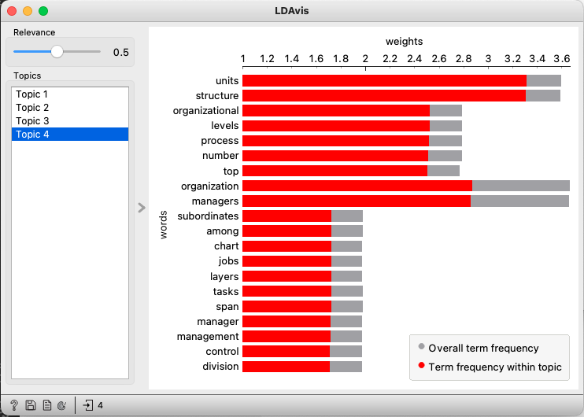

# Understanding common concerns in business meetings
The business problems I faced was that after several meetings on the same topic, multiple minute of meetings were written, and members were then trying to summarize them manually. Can't there be a way of analyzing these automatically and getting suggestion for common themes?

Searching the web for open source tools for text analysis, I found [Orange](https://orangedatamining.com/) which is a very easy and robust tool for data mining.

Further inspired by the [blog](https://orangedatamining.com/blog/2022/2022-03-18-ldavis/) by Ajda Pretnar Žagar, a visualization for LDA topic modelling was done on business documents.

For this repository, the topic modelling was done on a sample text found on the web on [Fundamentals of Business - Canadian Edition](https://open.bccampus.ca/browse-our-collection/find-open-textbooks/?uuid=1590234d-58a6-4841-85f7-53c5c587f2a2&contributor=&keyword=&subject=) which is freely available from OpenEd under [CC BY-NC-SA 4.0](https://creativecommons.org/licenses/by-nc-sa/4.0/). Key takeaway were chosen from four randomly chosen chapters:
1. "Ethics and Social Responsibility"
1. "Foundations of Business"
1. "Entrepreneurship: Starting a Business"
1. "Structuring Organizations"

The excerpts are available in [Fundamentals_of_Business.tab](./Fundamentals_of_Business.tab).

Widgets were configured as per the blog: 

In "Topic Modelling" I choose four topics, and we can for example see "Topic 3" seems related to ethics: 

"Topic 4" seems related to organizational structure: 

The topics of foundation and entrepreneurship however were not identified based on this sample.

The Orange analysis is available in [lda_analysis.ows](./lda_analysis.ows).
